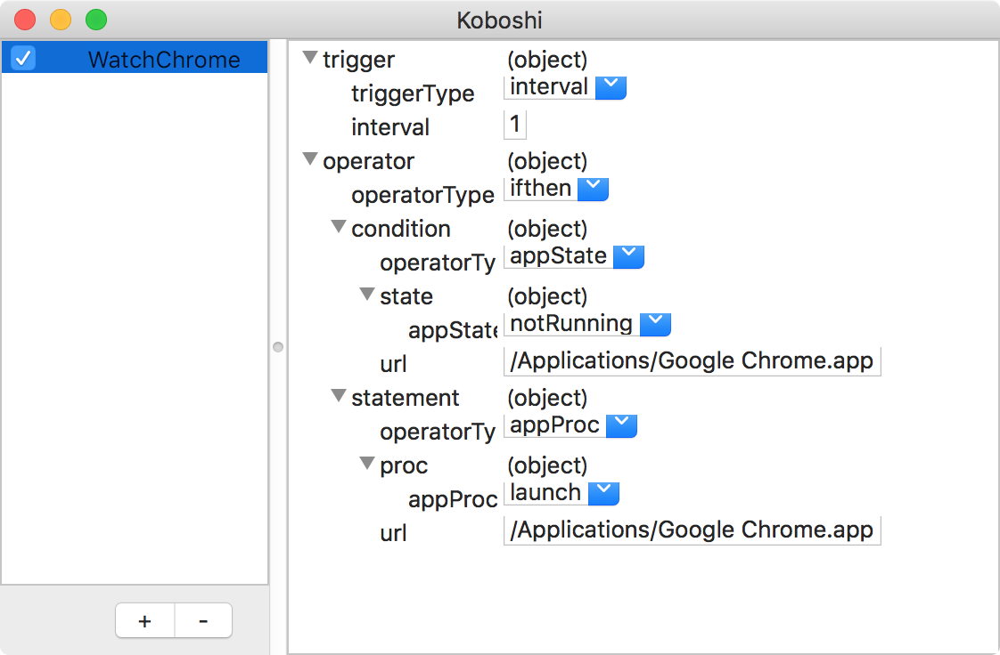
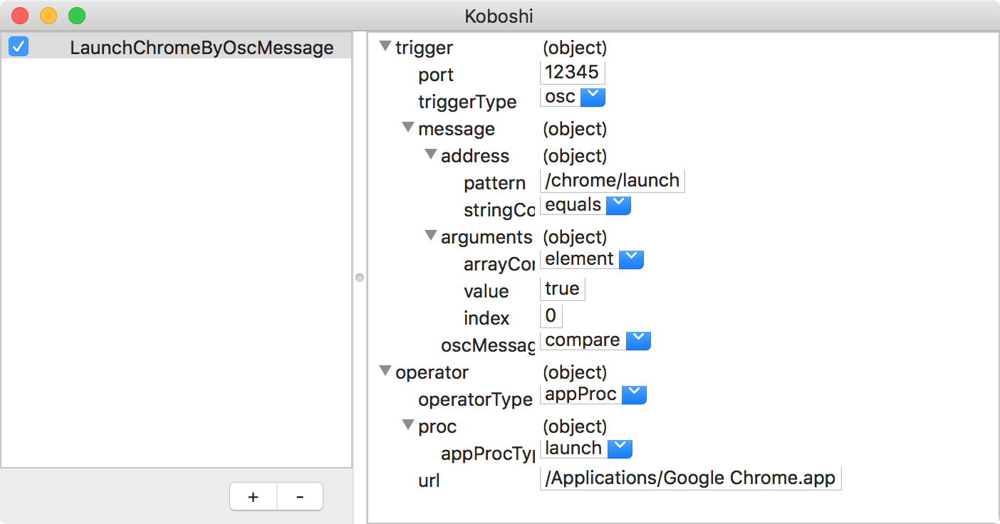

# Koboshi

Run things programmatically

## example

- Restart app automatically when crashed
- Execute shell script repeatedly
- Launch app by osc trigger

# What is "Koboshi"?

Its name comes from [_Okiagari-Koboshi_](https://en.wikipedia.org/wiki/Okiagari-koboshi) which gets up whenever he tumbled.  
The app originally designed for restarting app when it crashed. I think it's like Okiagari-Koboshi.  

> Okiagari-koboshi or Okiagari-kobōshi (起き上がり小法師, getting-up little priest) is a Japanese traditional doll. The toy is made from papier-mâché and is designed so that its weight causes it to return to an upright position if it is knocked over. Okiagari-kobōshi is considered a good-luck charm and a symbol of perseverance and resilience.

  
[CC BY-SA 3.0](https://commons.wikimedia.org/w/index.php?curid=1581707)

# LICENSE

MIT LICENSE  

Copyright 2018 nariakiiwatani

Permission is hereby granted, free of charge, to any person obtaining a copy of this software and associated documentation files (the "Software"), to deal in the Software without restriction, including without limitation the rights to use, copy, modify, merge, publish, distribute, sublicense, and/or sell copies of the Software, and to permit persons to whom the Software is furnished to do so, subject to the following conditions:

The above copyright notice and this permission notice shall be included in all copies or substantial portions of the Software.

THE SOFTWARE IS PROVIDED "AS IS", WITHOUT WARRANTY OF ANY KIND, EXPRESS OR IMPLIED, INCLUDING BUT NOT LIMITED TO THE WARRANTIES OF MERCHANTABILITY, FITNESS FOR A PARTICULAR PURPOSE AND NONINFRINGEMENT. IN NO EVENT SHALL THE AUTHORS OR COPYRIGHT HOLDERS BE LIABLE FOR ANY CLAIM, DAMAGES OR OTHER LIABILITY, WHETHER IN AN ACTION OF CONTRACT, TORT OR OTHERWISE, ARISING FROM, OUT OF OR IN CONNECTION WITH THE SOFTWARE OR THE USE OR OTHER DEALINGS IN THE SOFTWARE.